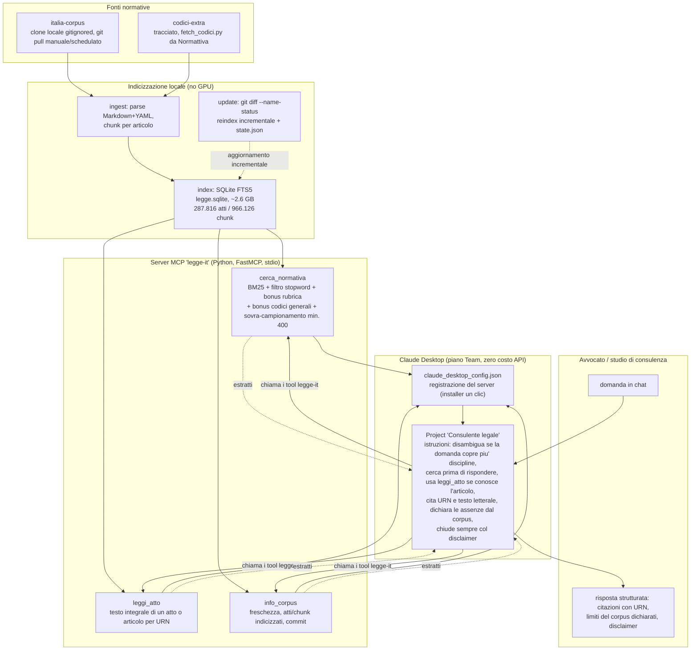

# Consulente Legale — Handoff iniziale per l'implementazione

> Documento di consegna per avviare lo sviluppo. **Versione 2.0** — 2026-06-25.
> Obiettivo: un assistente legale personale e aziendale, **sempre aggiornato** sulla
> normativa italiana, realizzato come **MCP server locale** interrogato da **Claude
> Desktop** (piano Team — nessun costo API), con retrieval **interamente locale**.

---

## 1. Obiettivo e scope

Strumento che risponde a domande legali (uso privato e aziendale) basandosi sul corpus
della legislazione italiana, citando gli atti normativi di riferimento.

**Decisioni di progetto (confermate):**
- **Forma del prodotto:** un **MCP server locale in Python** che espone strumenti di
  ricerca normativa. Il ragionamento e la chat li fa **Claude Desktop**, che l'utente già
  usa con server MCP (`obsidian-vaults`). → **usa l'abbonamento Team, zero token API.**
- **Deployment:** locale, su desktop Windows.
- **Privacy:** massima. Corpus e ricerca sono on-disk; Claude Desktop riceve solo la query
  e gli estratti normativi restituiti dai tool.
- **Retrieval:** **BM25 / full-text**, senza GPU e senza embedding (vedi §5). Indicizzazione
  quasi istantanea; forte sui match lessicali tipici del diritto (articoli, leggi, termini).
- **Ambito:** **solo diritto italiano**. Aggiornamento via `git pull` giornaliero del corpus.
- **Stack:** Python.

**Fuori scope (per ora):** diritto UE (EUR-Lex), embedding semantici, UI custom,
multi-utente, redazione di atti. Backlog in §7 Fase 4+.

> ⚠️ **Disclaimer obbligatorio:** lo strumento fornisce supporto informativo, **non
> costituisce consulenza legale** e non sostituisce un professionista abilitato. Per uso
> professionale fare sempre riferimento alla *Gazzetta Ufficiale*. Va inserito nelle
> istruzioni del Project di Claude Desktop (§5.4) e nell'output dei tool.

---

## 2. Perché MCP server invece di app + API

L'abbonamento **Claude Team (claude.ai)** e l'**API Anthropic** sono prodotti separati e
fatturati separatamente: il Team plan alimenta la chat/Claude Desktop ma **non** include
crediti API. Un'app custom che chiama l'API consumerebbe token pay-as-you-go.

Esponendo invece la ricerca normativa come **MCP server locale**, è **Claude Desktop** (già
incluso nel Team plan) a fare il ragionamento, chiamando i nostri tool per ottenere gli
estratti. Vantaggi: nessun costo API, riuso del setup MCP esistente, UI già pronta, stesso
confine di privacy (tutto locale tranne la chat, che passa per l'abbonamento).

Limiti da tenere presenti: meno controllo sul prompt di sistema (compensato dalle istruzioni
del Project, §5.4) e soggezione ai limiti d'uso del piano Team.

---

## 3. Fonte dati — `italia-corpus`
[github.com/ahmeabd/italia-corpus](https://github.com/ahmeabd/italia-corpus)

- **Contenuto:** >280.000 atti legislativi italiani da Normattiva, 23 collezioni.
- **Formato:** un file Markdown per atto, con **frontmatter YAML** (tipo, numero, data,
  titolo, URN, codice redazionale, stato di vigenza).
- **Dimensione:** alcuni GB.
- **Aggiornamento:** **automatico giornaliero**; ogni modifica normativa = un commit git
  → reindicizzazione **incrementale via `git diff`**.
- **Licenza:** contenuto di pubblico dominio (art. 5 L. diritto d'autore); script MIT.
- **Integrazione:** **git submodule**; `git pull` schedulato. È autonomo e self-updating,
  non serve costruire scraper.

> ⚠️ Lo schema esatto del frontmatter YAML va **verificato sul campo** all'inizio della
> Fase 1 prima di scrivere il parser (qui descritto dalla documentazione del repo).

---

## 4. Architettura

```
┌───────────────────────────────────────────────────────────────────────┐
│  DESKTOP (locale)                                                       │
│                                                                         │
│  ┌──────────────┐   git pull (schedulato)   ┌────────────────────────┐ │
│  │ italia-corpus │◀──────────────────────────│ Updater / Indexer      │ │
│  │  (submodule)  │                            │ - git diff → file new  │ │
│  └──────────────┘                             │ - parse MD+YAML        │ │
│         │                                      │ - chunk per articolo   │ │
│         └─────────────────────────────────────▶│ - scrive indice FTS5  │ │
│                                                └───────────┬────────────┘ │
│                                                            ▼              │
│                                              ┌──────────────────────────┐ │
│  ┌────────────────┐   chiama tool (stdio)    │ MCP server "legge-it"    │ │
│  │ Claude Desktop  │─────────────────────────▶│ (Python, FastMCP)        │ │
│  │ (piano Team)    │                          │ - cerca_normativa(...)   │ │
│  │                 │◀─────────────────────────│ - leggi_atto(...)        │ │
│  └────────────────┘  estratti + citazioni     │ ricerca BM25 su SQLite   │ │
│         │                                      │ FTS5 (locale, no GPU)    │ │
│         ▼                                      └──────────────────────────┘ │
│  risposta in chat con citazioni                                          │
│  (usa l'abbonamento — nessun token API)                                  │
└───────────────────────────────────────────────────────────────────────┘
```

**Confine di privacy:** corpus, indice e ricerca sono interamente locali. Solo la
conversazione (domanda + estratti restituiti dai tool) passa per Claude Desktop.

### 4.1 Flusso end-to-end as-built (2026-07-03)

Il diagramma di §4 descrive l'impostazione decisa prima dell'implementazione e resta come
riferimento di progetto. Il flusso realmente costruito, verificato end-to-end fino alla Fase
B, se ne discosta su alcuni punti: il corpus è un clone locale ignorato da git invece di un
submodule, l'indicizzazione applica un ranking pesato oltre al BM25 nudo, ed esiste un layer
di istruzioni nel Project di Claude Desktop non presente nel disegno iniziale. Il diagramma
seguente descrive lo stato reale.



Due percorsi restano fuori dal diagramma perché operativi, non conversazionali: il setup
iniziale (`install.cmd`/`install.ps1` → `scripts/setup.py` → registrazione in
`claude_desktop_config.json`, nodo D1) e l'aggiornamento periodico del corpus
(`scripts/update_corpus.py`, nodo B3), entrambi pensati per girare senza intervento tecnico
da parte dello studio legale che usa il prodotto.

---

## 5. Decisioni tecniche chiave

### 5.1 Retrieval: BM25 / full-text (no GPU)
- **Indice:** **SQLite FTS5** (incluso in Python, zero dipendenze esterne, BM25 nativo) —
  oppure `bm25s`/Tantivy se servirà più performance. SQLite FTS5 è la scelta di partenza:
  semplice, on-disk, ranking BM25 integrato.
- Tokenizzazione: `unicode61` con `remove_diacritics`; valutare una lista di stopword
  italiane e la gestione di abbreviazioni giuridiche (art., c.c., d.lgs., ecc.).
- **Niente embedding/GPU per l'MVP.** Il match lessicale è forte nel legale (numeri di
  articolo, nomi di leggi, termini tecnici). Embedding semantico leggero CPU
  (`multilingual-e5-small`, ONNX quantizzato) → solo in Fase 4 se il recall lessicale
  risulta insufficiente, per una ricerca ibrida.

### 5.2 Chunking
- **Granularità per articolo** (o comma per articoli lunghi): il chunk mappa 1:1 a un
  riferimento citabile.
- Metadati per chunk (colonne dell'indice): `urn`, `tipo_atto`, `numero`, `data`,
  `titolo_atto`, `articolo`, `vigente`, `path_file`. Servono per filtri e citazioni.

### 5.3 MCP server — strumenti esposti
Implementare con l'SDK ufficiale **`mcp`** (FastMCP), transport **stdio** (per Claude
Desktop). Tool proposti:

| Tool | Input | Output |
|---|---|---|
| `cerca_normativa` | `query`, `solo_vigenti=True`, `limit=8` | lista di estratti con `urn`, `atto`, `articolo`, `testo`, `score` |
| `leggi_atto` | `urn` (o `path`), `articolo?` | testo completo dell'atto o dell'articolo + metadati |
| `info_corpus` | — | data ultimo aggiornamento, n. atti indicizzati, ultimo commit |

Le **descrizioni dei tool** devono guidare Claude a citare sempre articolo + atto e a
usare `cerca_normativa` prima di rispondere su questioni normative.

### 5.4 Configurazione e istruzioni in Claude Desktop
- Registrare il server in `claude_desktop_config.json` (l'utente ha già questo file:
  `C:\Users\Utente\AppData\Local\Packages\Claude_pzs8sxrjxfjjc\LocalCache\Roaming\Claude\claude_desktop_config.json`).
  Esempio voce:
  ```json
  "legge-it": {
    "command": "uv",
    "args": ["--directory", "E:\\legal-consultant", "run", "python", "-m",
             "legal_consultant.mcp_server"]
  }
  ```
- Creare un **Project "Consulente Legale"** in Claude Desktop con istruzioni custom (questo
  sostituisce il system prompt): "usa sempre i tool `legge-it`, rispondi solo sulla base
  degli estratti restituiti, cita sempre articolo e atto con il loro URN, dichiara quando
  l'informazione non è nel corpus, includi il disclaimer".
- **Aggiornamento 'live':** il corpus arriva fino all'ultimo `git pull`. Per le ultimissime
  novità (Gazzetta Ufficiale del giorno, sentenze) si può usare il **web search di Claude
  Desktop**, da attivare consapevolmente vista la natura della query.

### 5.5 Aggiornamento incrementale
- Ogni modifica normativa è un commit ⇒ dopo `git pull`, usare `git diff --name-status` tra
  il commit precedente e quello nuovo per reindicizzare **solo i file cambiati**
  (aggiunti/modificati → upsert; eliminati → delete). Salvare il commit hash dell'ultima
  indicizzazione. La ricostruzione FTS5 è comunque economica anche da zero.

---

## 6. Struttura del progetto proposta

```
legal-consultant/
├── HANDOFF.md                  # questo documento
├── README.md
├── pyproject.toml              # dipendenze (uv); include `mcp`, `python-frontmatter`
├── .env.example                # solo percorsi locali
├── .gitignore
├── data/
│   ├── italia-corpus/          # git submodule (self-updating)
│   └── index/
│       ├── legge.sqlite        # indice FTS5 (su disco, rigenerabile)
│       └── state.json          # ultimo commit indicizzato
├── src/
│   └── legal_consultant/
│       ├── ingest/             # parsing MD+YAML, chunking per articolo
│       ├── index/              # SQLite FTS5: build, upsert, query BM25
│       ├── update/             # git pull + diff + reindex incrementale
│       ├── mcp_server.py       # FastMCP: cerca_normativa, leggi_atto, info_corpus
│       └── config.py
├── scripts/
│   ├── bootstrap_index.py      # prima indicizzazione completa
│   └── update_corpus.py        # pull + reindex incrementale (schedulabile)
└── tests/
```

---

## 7. Roadmap a fasi

**Fase 0 — Setup (½ giorno)**
- Init repo, `pyproject.toml` (uv), submodule `italia-corpus`, struttura cartelle.

**Fase 1 — Ingestion & indice FTS5 (1–2 giorni)**
- Verificare lo schema YAML reale del corpus.
- Parser MD+YAML → chunk per articolo con metadati.
- Costruire l'indice SQLite FTS5; `bootstrap_index.py` sull'intero corpus.
- Verifica: query di test restituiscono gli articoli pertinenti con buon ranking.

**Fase 2 — MCP server (1–2 giorni)**
- FastMCP con `cerca_normativa`, `leggi_atto`, `info_corpus`; transport stdio.
- Descrizioni dei tool orientate alla citazione.
- Registrazione in `claude_desktop_config.json`; test end-to-end in Claude Desktop.
- Creazione del Project "Consulente Legale" con istruzioni + disclaimer.

**Fase 3 — Aggiornamento automatico (½–1 giorno)**
- `update_corpus.py` (pull + diff + reindex incrementale) + Windows Task Scheduler giornaliero.
- Tool `info_corpus` per mostrare data/commit dell'ultimo aggiornamento.

**Fase 4+ — Estensioni (a seguire)**
- Ricerca ibrida con embedding leggero CPU (`multilingual-e5-small` ONNX) se serve recall
  semantico; reranking. Diritto UE (EUR-Lex). Anonimizzazione opzionale. Valutazione di
  un'app/API custom in alternativa, riusando ingest+index come libreria.

---

## 8. Rischi e mitigazioni

| Rischio | Mitigazione |
|---|---|
| Recall del solo BM25 insufficiente su query "concettuali" | Buona tokenizzazione + sinonimi; embedding ibrido in Fase 4 se necessario |
| Risposte non aggiornate all'ultimo minuto | `git pull` giornaliero + web search di Desktop opzionale; disclaimer su G.U. |
| Allucinazioni / citazioni errate | Istruzioni del Project: rispondere solo dagli estratti, citare URN; tool che ritornano testo verificabile |
| Limiti d'uso del piano Team | Monitorare; query mirate; estratti concisi restituiti dai tool |
| Schema YAML diverso dal previsto | Verifica sul campo in Fase 1 prima del parser |
| Responsabilità legale | Disclaimer prominente; nessuna presentazione come consulenza vincolante |

---

## 9. Prossimi passi

Confermata questa impostazione, si parte con **Fase 0 + Fase 1**: setup repo, submodule del
corpus, parser MD+YAML e prima indicizzazione FTS5. Primo punto operativo: clonare il corpus
e ispezionare lo schema reale del frontmatter di alcuni atti rappresentativi.
