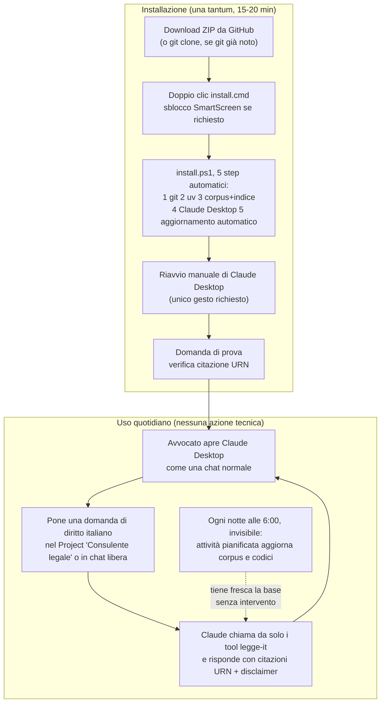
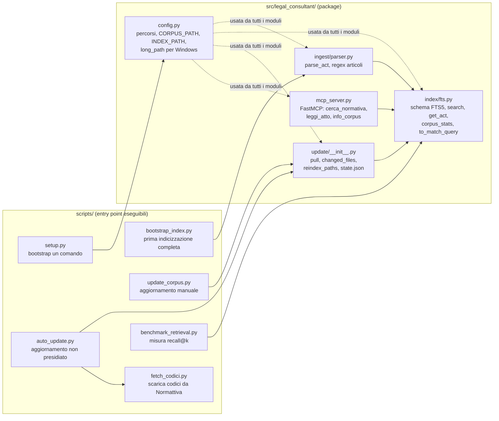
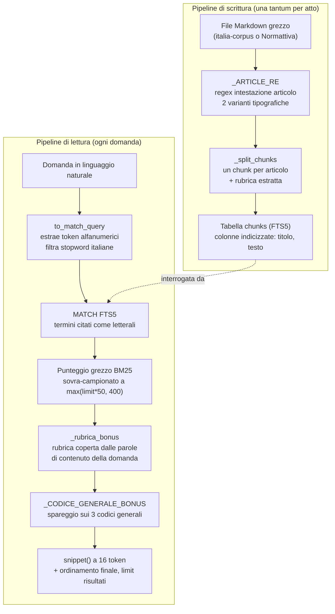

# Flusso operativo e architettura a tre livelli

> Documento di progetto, tracciato. Descrive due cose distinte: il percorso reale che una postazione di studio legale attraversa dal download del progetto all'uso quotidiano, e i tre livelli a cui si può leggere l'architettura del prodotto — operativo, tecnico, linguistico — ciascuno con un proprio diagramma. Il diagramma di flusso dati as-built resta in `HANDOFF.md` §4.1 ed è il riferimento per il livello tecnico: qui non si duplica, si ricontestualizza.

## 1. Flusso su una postazione di studio legale

Il destinatario di questo flusso è un utente non tecnico: l'avvocato o il personale di segreteria di uno studio, su un PC Windows 11 già in uso per il lavoro quotidiano, senza competenze di programmazione né privilegi di amministratore garantiti. Il percorso si divide in due fasi nettamente separate nel tempo: l'installazione, che avviene una sola volta e richiede 15-20 minuti di cui la maggior parte è download e indicizzazione senza intervento, e l'uso quotidiano, che dopo l'installazione non richiede più alcuna azione tecnica.

Nella fase di installazione, il primo bivio è come procurarsi il progetto: chi non ha *git*[^1] installato scarica lo ZIP del repository da GitHub, lo estrae in una cartella stabile del proprio disco (non `Desktop` o `Download`, per evitare che una pulizia periodica cancelli il corpus indicizzato) ed esegue `install.cmd` con un doppio clic. Windows può mostrare l'avviso SmartScreen perché lo script non è firmato digitalmente: si sblocca da "Ulteriori informazioni" → "Esegui comunque", un passo descritto esplicitamente in `README.md` proprio perché un utente non tecnico non lo riconoscerebbe come sicuro di default. Da qui l'installer (`install.ps1`) procede da solo: verifica se *git* e *uv*[^2] sono già presenti e li installa solo se mancano, scarica il corpus normativo (`data/italia-corpus`, un clone shallow di circa 2 GB), costruisce l'indice di ricerca locale (`data/index/legge.sqlite`, SQLite con *FTS5*[^3]), registra il server MCP[^4] `legge-it` dentro la configurazione di Claude Desktop preservando gli altri server eventualmente già presenti, e registra un'attività pianificata di Windows che aggiornerà da sola corpus e codici ogni giorno alle 6:00, senza privilegi di amministratore. L'unico gesto finale richiesto all'utente è chiudere del tutto Claude Desktop (anche dall'icona vicino all'orologio) e riaprirlo, perché il client legge la configurazione dei server MCP solo all'avvio. Una domanda di prova su un argomento di diritto italiano, con risposta che cita atto e articolo con URN, chiude la verifica.

Nella fase di uso quotidiano non c'è più nulla da avviare o configurare: Claude Desktop resta il programma che l'avvocato apre come farebbe con qualunque chat, e il server `legge-it` gira come processo in background invocato automaticamente dal client. Se lo studio ha creato il Project "Consulente legale" (facoltativo, con le istruzioni di `prompts/consulente-legale.md`), le domande vanno poste in quella conversazione dedicata; altrimenti Claude Desktop propone comunque il tool ogni volta che la domanda riguarda diritto italiano. L'aggiornamento del corpus e dei codici fondamentali avviene ogni notte senza che l'utente lo veda: l'unico segnale visibile, quando rilevante, è la risposta di `info_corpus` che riporta quanto è fresca la base normativa.

## 2. Tre livelli di lettura del progetto

Lo stesso prodotto si può descrivere a tre altezze diverse, e ciascuna risponde a una domanda diversa: il livello *operativo* risponde a "cosa succede quando l'avvocato fa una domanda", il livello *tecnico* risponde a "quali componenti software collaborano e come", il livello *linguistico* risponde a "come viene trasformato un testo di legge grezzo in un risultato di ricerca ordinato". Nessuno dei tre sostituisce gli altri: un collega che deve solo usare il prodotto ha bisogno solo del primo, chi deve manutenerlo ha bisogno anche del secondo, e chi deve intervenire sul ranking o sul parsing ha bisogno anche del terzo.

### 2.1 Livello operativo

Coincide con la sezione 1 sopra: il diagramma di flusso installazione → uso quotidiano è già la lettura operativa del progetto, pensata per chi lo usa, non per chi lo costruisce.

### 2.2 Livello tecnico

Il diagramma di riferimento è quello *as-built* in `HANDOFF.md` §4.1, che descrive il flusso dati reale tra fonti normative, indicizzazione, server MCP e Claude Desktop, verificato end-to-end. A complemento, il diagramma seguente guarda lo stesso sistema dal lato dei moduli di codice invece che del flusso dati, utile per orientarsi quando si deve modificare qualcosa:

### 2.3 Livello linguistico

È il livello più fine: come un file Markdown del corpus diventa testo interrogabile, e come una domanda in linguaggio naturale diventa una query FTS5 con un ranking corretto. Due pipeline distinte, una in scrittura (indicizzazione) e una in lettura (ricerca), entrambe dentro `src/legal_consultant/ingest/parser.py` e `src/legal_consultant/index/fts.py`.

In scrittura, `_ARTICLE_RE` è l'espressione regolare che riconosce l'intestazione di un articolo in due varianti tipografiche diverse a seconda della fonte — un trattino dopo il numero per italia-corpus, una rubrica tra parentesi per i testi scaricati da Normattiva — e `_split_chunks` usa quel confine per spezzare l'atto in un chunk per articolo, cosa che rende la granularità della ricerca l'articolo e non l'intero atto normativo. In lettura, `to_match_query` prende il testo libero della domanda, ne estrae solo i token alfanumerici, scarta le *stopword*[^5] italiane (altrimenti "di" o "nel" da soli abbinerebbero centinaia di migliaia di righe e diluirebbero il campione) e li cita come termini letterali per l'operatore `MATCH` di FTS5, così un input non tecnico non può comporre per errore un'espressione MATCH invalida. Il punteggio grezzo restituito da FTS5 è BM25[^6]; sopra quel punteggio la funzione `search` applica due correzioni pesate — `_rubrica_bonus`, che premia gli articoli la cui rubrica è quasi interamente coperta dalle parole di contenuto della domanda, e `_CODICE_GENERALE_BONUS`, uno spareggio fisso sui tre codici generali quando due codici condividono la stessa rubrica — su una finestra di ricalcolo sovra-campionata a `max(limit * 50, 400)` righe, perché la normalizzazione per lunghezza di BM25 può relegare l'articolo giusto ben oltre la finestra se il suo testo è lungo. Il testo restituito all'utente finale non è mai l'articolo intero ma uno *snippet*[^7] di 16 token intorno al punto di corrispondenza, generato dalla funzione nativa `snippet()` di FTS5.

---

[^1]: *git* — sistema di controllo di versione distribuito, usato qui sia per il repository del progetto sia per scaricare e aggiornare il corpus normativo come clone locale.
[^2]: *uv* — gestore di ambienti e pacchetti Python, usato per installare le dipendenze e lanciare il server senza richiedere una configurazione manuale di Python.
[^3]: *FTS5*, Full-Text Search 5 — estensione di SQLite per la ricerca full-text, usata qui come motore di indicizzazione locale senza bisogno di un database server separato né di GPU.
[^4]: *MCP*, Model Context Protocol — protocollo che permette a Claude Desktop di invocare strumenti esterni (qui i tre tool `cerca_normativa`, `leggi_atto`, `info_corpus`) esposti da un processo locale.
[^5]: *Stopword* — parole molto frequenti e poco informative (articoli, preposizioni) che si escludono dall'indicizzazione o dalla query perché non discriminano il contenuto.
[^6]: *BM25* — funzione di ranking usata da FTS5 per ordinare i risultati di una ricerca full-text in base alla rilevanza statistica dei termini rispetto al documento e alla collezione.
[^7]: *Snippet* — estratto breve di testo centrato sul punto di corrispondenza, restituito al posto del testo integrale per mantenere la risposta del tool concisa.
